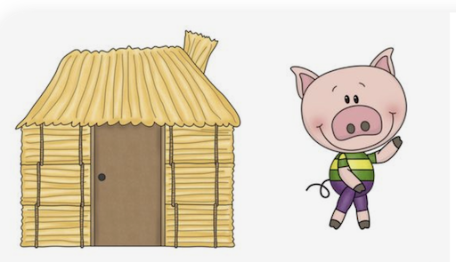
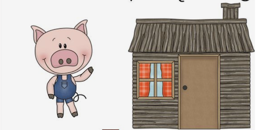
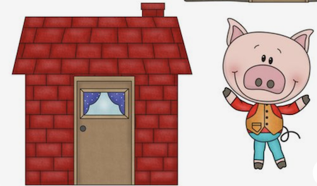

# 4 Wheels public k8s ingress - An evil fairy tail

  

## What did you want to do?

Expose my [service](#The-Basics---What-is-a-service-?) ( k8s service ) deployed on 4 wheels k8s service to the internet...

 
 
 
 
 
 

### First option - LoadBalancer
***
  
 
 
Non HTTP port to be exposed, service LoadBalancer  

Azure should create an external IP - it did  
`kubectl get svc -n dsmp-dev-1`
(not reachable with/without VPN)

> Conclusion Load Balancer is 'closed' to k8s itself.

         

### Second option - public Ingress
***
  

Maybe using an ingress? [ingress basics](../networking/ingress.md)  
Let's use a nginx for the testing, to be sure it works and easy to reach ( nginx-hello:latest )  
  

Created the service has NodePort  
`kubectl get svc -n dsmp-dev-1`  
No external IP - expected  
Create the ingress with host hello.dsmpinno40m.4wheels.onazure.cloud.bmw so we could test

`kubectl get ing -n dsmp-dev-1`  

> Works! But only inside VPN :(

Investigation, reached https://4wheels-docs.bmwgroup.net/  
- find for public in docs

Followed the guide 
Create:
- resource group
- public VNET + peering
- application gateway
- created public IP
- public ingress controller (kube-devops namespace)
- ingress resource ( my namespace)

*And it worked!*
- show ingress + describe
- show app gtw 
- show in browser (nginx + /mqtt-monitor/status)

**But was this what i wanted?**

> Added costs, less security, more configuration needed on app gateway ( remember what
 i want to expose is not HTTP )

         

### Last option - Container registry
***
  

What if, instead of fighting against 4 wheels you embrace it?  
Container registry k8s poor cousin 
It is an azure service :( , but acts just like k8s: you deploy an image from acr :) ( or other ) 

-- SHOW DIAGRAM --
-- SHOW Azure --

         

### One other option - IoT Hub
***
  

For mqtt specific use case  

Upside
- One less service to manage
- auto scale out/up
- supporting multiple other IOT protocols

Downsides 
- Azure specific
- Hard to work without Azure SDKs
- Mqtt 'mode' only has 1 topic 
- Will be used by the MS fanboys to keep you in azure forever :P

     

## The Basics - What is a service ?
Pods - your "running" image
- get their own IP, but can be destroyed anytime

Services give a way of communicating to pods of certain type 
- no matter how many there are how what the current IP is  
[top](###-What-did-you-want-to-do?) 

