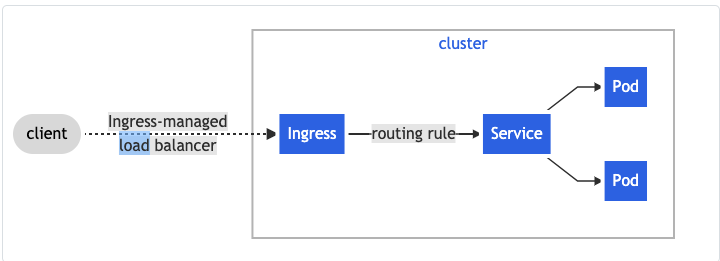

# k8s Ingress

## Doc Purpose
This doc has information and links to resources that help understand ingress and other related concepts.
The goal is to explain/provide explanation material for the subject.

## Before we start
Some concepts need to be explained first, skip the sections you already know.

### Controller
A Controller ( or control loop ) is basically a piece of never ending software that always tries to move from "current state" to "desired state".
Kubernetes uses controllers to manage it's resources; instead of a massive monolith to controller everything, the logic it's spread out in controllers

#### Examples of controllers
1. Replication Controller
2. Endpoints Controller
3. Namespace controller
4. ServiceAccounts controller

#### References 
https://kubernetes.io/docs/concepts/architecture/controller/

## Ingress Controller
Ingress controller is the type of controller that is responsible for the ingress (k8s resource).
Ingress controllers are not automatically deployed in k8s.

### 4Wheels - private
On 4wheels a default ingress controller is created(provisioned) by default.
This ingress controller is easy to use but it only exposes k8s services to the BMW corporate network.  
More on how to create this public ingress on [4Wheels](https://4wheels-docs.bmwgroup.net/azure/40_examples/31_create_an_external_ingress/#create-a-publicexternal-ingress-controller) - reference 2.

### References 
1. https://kubernetes.io/docs/concepts/services-networking/ingress-controllers/
2. (bmw) https://4wheels-docs.bmwgroup.net/azure/40_examples/31_create_an_external_ingress/#create-a-publicexternal-ingress-controller

## Ingress
The ingress is the actual object we want to achieve. It is the ingress that allows us to expose HTTP/HTTPS routes to the cluster services.

  

The ingress will use the ingress controller to satisfy the ingress request.

### What if i have multiple ingress controllers ?!
IngressClass resource is used so k8s can understand which ingress controller the ingress is requesting

### References
1. https://kubernetes.io/docs/concepts/services-networking/ingress/

